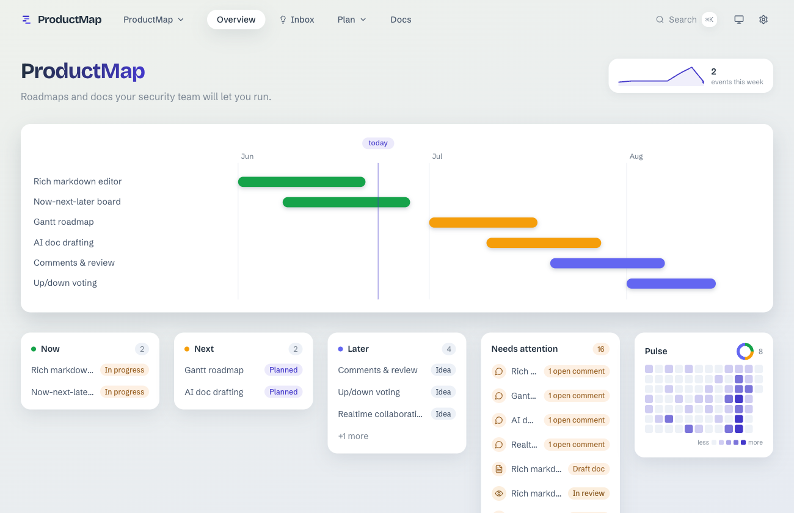
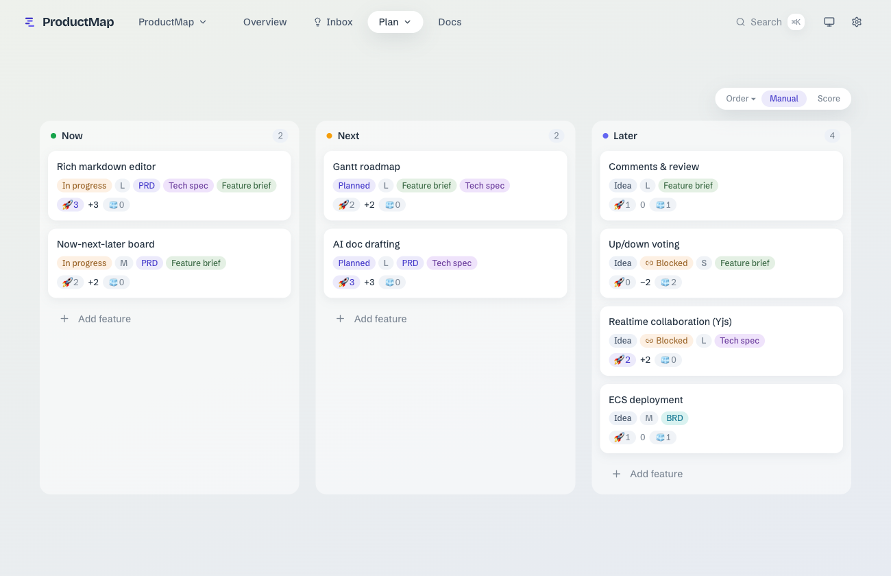
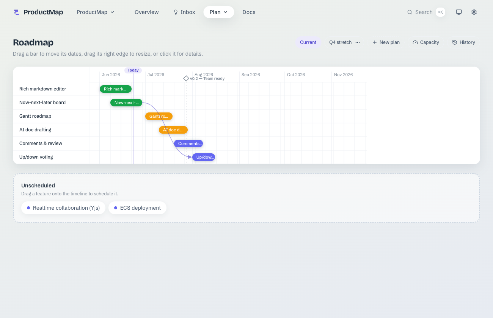
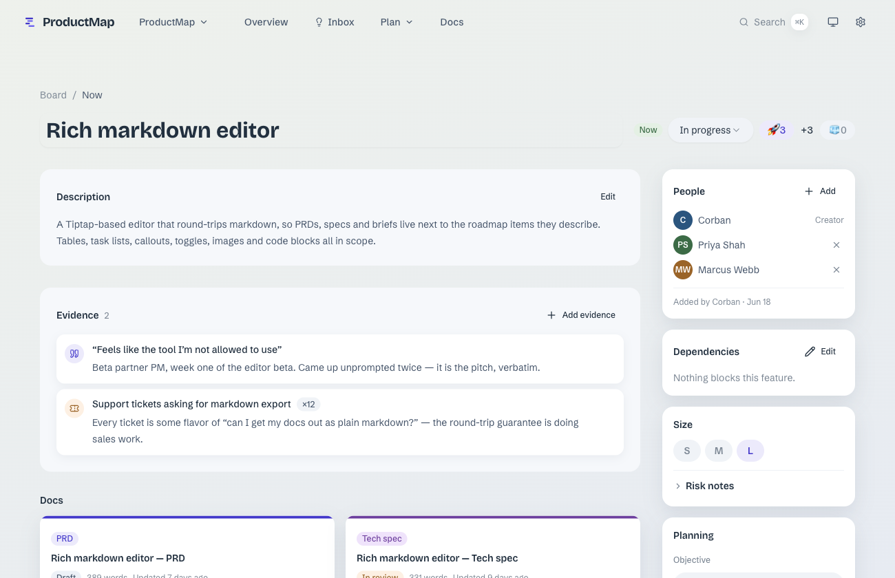
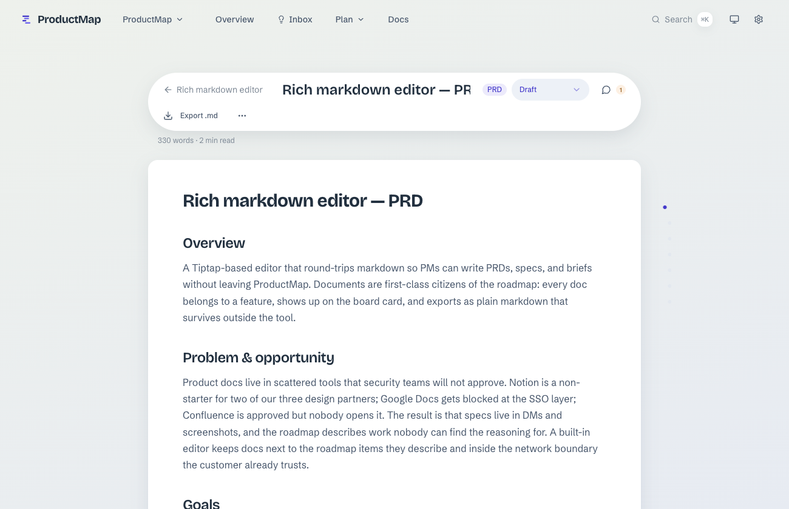
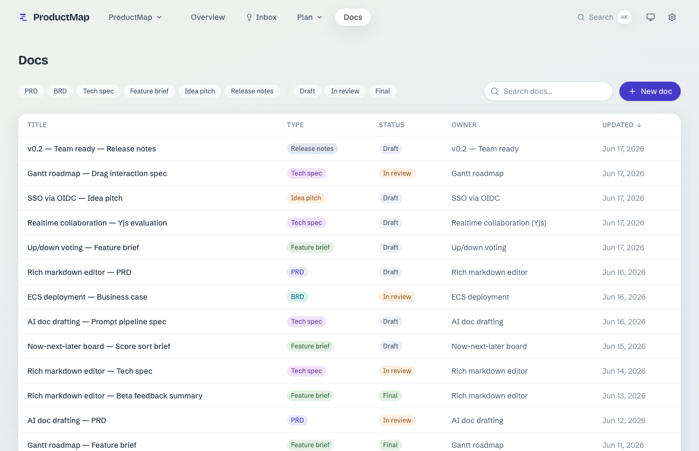
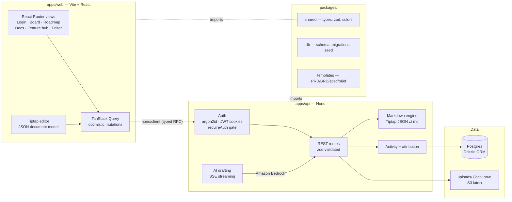

# ProductMap

**Self-hosted product management for teams that can't use Jira or Notion.**

[](LICENSE)
[](.github/workflows/ci.yml)

ProductMap is a roadmap-and-docs tool you run on your own infrastructure. Write PRDs, BRDs, tech specs, and feature briefs in a rich Notion-style editor; plan with a now-next-later board and a drag-to-schedule Gantt roadmap; discuss with threaded comments; prioritize with 🚀 Boost / 🧊 Cool voting. Everything exports to plain markdown whenever you want it.



## Why

Security constraints rule out SaaS PM tools for some teams. ProductMap keeps the workflow — collaborative docs, roadmaps, comments, voting — on hardware you control, backed by Postgres, exportable to markdown at any moment.

## Features

### Accounts & roles
Email + password sign-in with secure, httpOnly cookie sessions (passwords hashed with argon2id). The first account to register becomes the **admin**; an admin-only **Users** tab in Settings creates accounts, assigns `admin`/`member` roles, resets passwords, and deactivates users. Optional GitHub/Google sign-in is planned. Works fully offline — no external identity provider required.

### Now / Next / Later board
Drag features between horizons. Vote with 🚀/🧊 on every card, sort columns by score or keep manual order, click any card for a quick peek — or open the full feature page.



### Gantt roadmap
Drag bars to move dates, grab the right edge to resize, drop unscheduled features onto the timeline to schedule them. Horizon colors match everywhere: green = now, amber = next, indigo = later.



### Feature hub
Every feature gets a management page: description, attached docs, people (creator + collaborators), dates, threaded comments with resolve/reopen, and a full activity feed of who changed what.



### Rich document editor
Tiptap-based block editor with slash commands (`/` for headings, tables, task lists, images, code blocks), image upload/paste, autosave, doc-level comments, and one-click markdown export. Docs are created from real templates: **PRD, BRD, Tech spec, Feature brief**.



### Docs library
Browse every document across the workspace: filter by type and status, search, sort, preview rendered markdown in place, then jump into the editor.



### AI drafting (optional)
AI drafting runs on **Claude via Amazon Bedrock** (Vercel AI SDK). With AWS credentials available — any of `AWS_REGION`, `AWS_PROFILE`, or `AWS_ACCESS_KEY_ID` set, with the standard AWS credential chain (env vars, shared config/SSO profiles, or an IAM task role when running on ECS) resolving the rest — an empty doc offers **Draft with AI**: describe the feature in a sentence and a complete, template-structured document streams into the editor. Override the model with `BEDROCK_MODEL_ID` (defaults to `us.anthropic.claude-sonnet-4-5-20250929-v1:0`). Without credentials, the feature hides itself — everything else works fully offline. _(Provider-agnostic AI — bring-your-own key for Anthropic/OpenAI/Ollama — is on the roadmap.)_

### Markdown is always yours
- Any doc → `Export .md`
- Whole workspace → `GET /api/export.zip` (one folder per feature, one `.md` per doc)

## Quick start

Prerequisites: **Node 20+**, **pnpm 9+**, and Postgres running locally ([Postgres.app](https://postgresapp.com) on macOS works great).

```bash
# 1. Create the database (once)
createdb productmap

# 2. Install, migrate, seed, run
pnpm install
pnpm db:migrate
pnpm db:seed
pnpm dev
```

Open **http://localhost:5173** — you'll be sent to the login page. The seed creates a dev admin:

```
admin@productmap.local / devpassword123
```

> **Heads up (dev):** without `AUTH_SECRET` set, the API uses an ephemeral signing secret and logs a warning — sessions reset on restart. Set `AUTH_SECRET` for a stable session. In **production the API refuses to boot without `AUTH_SECRET`.**

For a fresh install with no seed data, the **first account you register becomes the admin**; self-signup is then disabled by default (enable with `ALLOW_OPEN_SIGNUP=true`), and the admin invites others from Settings → Users.

Optional `.env` in `apps/api/`:

```bash
DATABASE_URL=postgres://localhost:5432/productmap   # default shown
AUTH_SECRET=change-me                               # REQUIRED in production; signs session cookies
ALLOW_OPEN_SIGNUP=false                             # true → anyone can self-register
TRUST_PROXY=false                                   # true when behind a reverse proxy (reads X-Forwarded-For)
AWS_REGION=us-east-1                                # enables AI drafting (Bedrock)
AWS_PROFILE=my-profile                              # optional — any credential-chain source works
BEDROCK_MODEL_ID=...                                # optional model override
PORT=3411                                           # api port (default shown)
```

Generate a strong secret with `openssl rand -hex 32`.

### Scripts

| Command | What it does |
|---|---|
| `pnpm dev` | Run API (:3411) + web (:5173) together |
| `pnpm test` | All unit + integration tests (needs `productmap_test` db: `createdb productmap_test`) |
| `pnpm e2e` | Playwright end-to-end suite |
| `pnpm db:migrate` / `db:seed` / `db:reset` | Database lifecycle |
| `pnpm build` | Production builds |

## Architecture



**Key decisions**
- **Tiptap JSON is the source of truth**; markdown is derived server-side on every save. Lossless editing now, clean export always, and a straight path to CRDT-based realtime collaboration later.
- **One `features` table powers every view** — board columns, Gantt bars, and landing panels can't drift apart.
- **End-to-end types without codegen** — the web app imports the API's type via `hono/client`.
- **Stateless cookie auth** — a short-lived access JWT (verified with no DB read on the hot path) plus a refresh token; revocation rides on a per-user `token_version`. Every `/api/*` route is gated except a small public allowlist (health, auth, share links).

```
product-map/
├── apps/
│   ├── api/          # Hono server: auth, REST, uploads, export, AI (SSE)
│   └── web/          # Vite + React + Tailwind + shadcn/ui
├── packages/
│   ├── shared/       # types, zod schemas, semantic color system
│   ├── db/           # Drizzle schema, migrations, seed
│   └── templates/    # document templates + AI prompt hints
├── e2e/              # Playwright suite
└── docs/             # specs, plans, verification artifacts
```

## Testing

TDD throughout, at three levels:

- **Unit** — zod schemas, password hashing, JWT, rate limiting, markdown round-trip, Gantt math, color maps
- **Integration** — every API route against a real Postgres test database, behind real auth
- **End-to-end** — Playwright covering the full flow (login → create → edit → drag → vote → comment → export) plus admin user management

```bash
pnpm test && pnpm e2e
```

CI runs typecheck, build, the full test suite, and e2e on every pull request — see [`.github/workflows/ci.yml`](.github/workflows/ci.yml).

## Roadmap

Open-source roadmap and per-phase design specs live in [`docs/superpowers/specs/`](docs/superpowers/specs/).

- ✅ **Phase 1 — Authentication** (email/password, cookie sessions, roles, admin user management)
- 🔜 **Phase 2 — Multiple projects** with per-project membership and roles
- 🔜 **Phase 3 — Public marketing landing**
- 🔭 Later — provider-agnostic AI, realtime collaboration (Yjs), global search

ProductMap's own roadmap is the seed data, so the app dogfoods its future.

## Contributing

Contributions are welcome! See [CONTRIBUTING.md](CONTRIBUTING.md) for dev setup and conventions, and please follow our [Code of Conduct](CODE_OF_CONDUCT.md). For security issues, see [SECURITY.md](SECURITY.md) — please don't open public issues for vulnerabilities.

## License

[MIT](LICENSE) © studiox4. Self-host it, fork it, build on it — see the [demo](https://product-map-production.up.railway.app).
