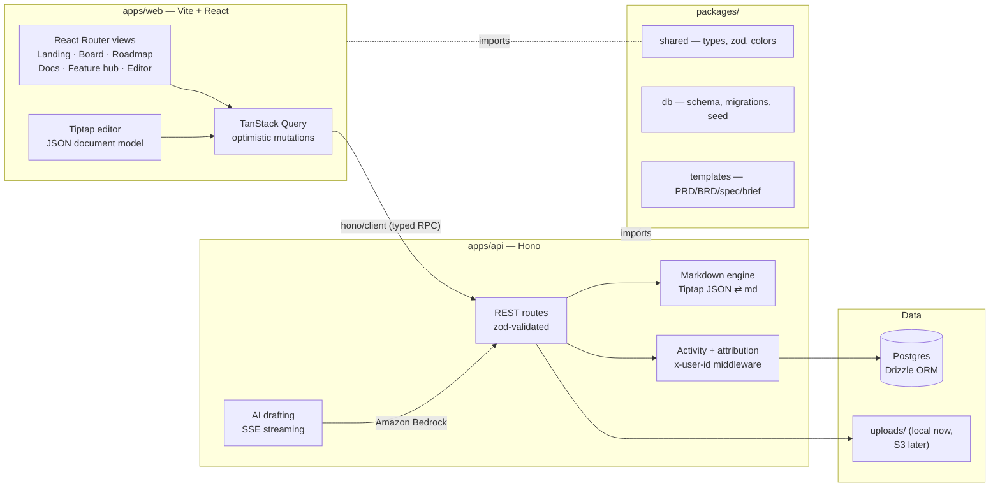

# ProductMap

**Self-hosted product management for teams that can't use Jira or Notion.**

ProductMap is a roadmap-and-docs tool you run on your own infrastructure. Write PRDs, BRDs, tech specs, and feature briefs in a rich Notion-style editor; plan with a now-next-later board and a drag-to-schedule Gantt roadmap; discuss with threaded comments; prioritize with 🚀 Boost / 🧊 Cool voting. Everything exports to plain markdown whenever you want it.


## Why

Security constraints rule out SaaS PM tools for some teams. ProductMap keeps the workflow — collaborative docs, roadmaps, comments, voting — on hardware you control, backed by Postgres, exportable to markdown at any moment.

## Features

### Now / Next / Later board
Drag features between horizons. Vote with 🚀/🧊 on every card, sort columns by score or keep manual order, click any card for a quick peek — or open the full feature page.


### Gantt roadmap
Drag bars to move dates, grab the right edge to resize, drop unscheduled features onto the timeline to schedule them. Horizon colors match everywhere: green = now, amber = next, indigo = later.


### Feature hub
Every feature gets a management page: description, attached docs, people (creator + collaborators), dates, threaded comments with resolve/reopen, and a full activity feed of who changed what.


### Rich document editor
Tiptap-based block editor with slash commands (`/` for headings, tables, task lists, images, code blocks), image upload/paste, autosave, doc-level comments, and one-click markdown export. Docs are created from real templates: **PRD, BRD, Tech spec, Feature brief**.


### Docs library
Browse every document across the workspace: filter by type and status, search, sort, preview rendered markdown in place, then jump into the editor.


### AI drafting (optional)
AI drafting runs on **Claude via Amazon Bedrock** (Vercel AI SDK). With AWS credentials available — any of `AWS_REGION`, `AWS_PROFILE`, or `AWS_ACCESS_KEY_ID` set, with the standard AWS credential chain (env vars, shared config/SSO profiles, or an IAM task role when running on ECS) resolving the rest — an empty doc offers **Draft with AI**: describe the feature in a sentence and a complete, template-structured document streams into the editor. Override the model with `BEDROCK_MODEL_ID` (defaults to `us.anthropic.claude-sonnet-4-5-20250929-v1:0`). Without credentials, the feature hides itself — everything else works fully offline.

### Markdown is always yours
- Any doc → `Export .md`
- Whole workspace → `GET /api/export.zip` (one folder per feature, one `.md` per doc)

## Quick start

Prerequisites: **Node 20+**, **pnpm 9+**, and Postgres running locally ([Postgres.app](https://postgresapp.com) on macOS works great).

```bash
# 1. Create the database (once)
createdb productmap

# 2. Install, migrate, seed, run
pnpm install
pnpm db:migrate
pnpm db:seed
pnpm dev
```

Open **http://localhost:5173**. First visit asks your name (no password — single-tenant demo); everything you create is attributed to you.

Optional `.env` in `apps/api/`:

```bash
DATABASE_URL=postgres://localhost:5432/productmap   # default shown
AWS_REGION=us-east-1                                # enables AI drafting (Bedrock)
AWS_PROFILE=my-profile                              # optional — any credential-chain source works
BEDROCK_MODEL_ID=...                                # optional model override
PORT=3411                                           # api port (default shown)
```

### Scripts

| Command | What it does |
|---|---|
| `pnpm dev` | Run API (:3411) + web (:5173) together |
| `pnpm test` | All unit + integration tests (needs `productmap_test` db: `createdb productmap_test`) |
| `pnpm e2e` | Playwright end-to-end suite |
| `pnpm db:migrate` / `db:seed` / `db:reset` | Database lifecycle |
| `pnpm build` | Production builds |

## Architecture



**Key decisions**
- **Tiptap JSON is the source of truth**; markdown is derived server-side on every save. Lossless editing now, clean export always, and a straight path to CRDT-based realtime collaboration later.
- **One `features` table powers every view** — board columns, Gantt bars, and landing panels can't drift apart.
- **End-to-end types without codegen** — the web app imports the API's type via `hono/client`.
- **Identity without auth (for now)** — a lightweight local profile attributes every change; the schema (`users`, `created_by`, `feature_collaborators`, `activity`) is what real auth plugs into.

```
product-map/
├── apps/
│   ├── api/          # Hono server: REST, uploads, export, AI (SSE)
│   └── web/          # Vite + React + Tailwind + shadcn/ui
├── packages/
│   ├── shared/       # types, zod schemas, semantic color system
│   ├── db/           # Drizzle schema, migrations, seed
│   └── templates/    # document templates + AI prompt hints
├── e2e/              # Playwright suite (45 tests)
└── docs/             # specs, plans, verification artifacts
```

## Testing

TDD throughout. ~280 tests at three levels:

- **Unit** — zod schemas, markdown round-trip (tables, task lists, nested lists), Gantt math, color maps
- **Integration** — every API route against a real Postgres test database
- **End-to-end** — 45 Playwright tests covering the full acceptance criteria: create → edit → drag → vote → comment → export, including a two-user permission check

```bash
pnpm test && pnpm e2e
```

## Roadmap

See [BACKLOG.md](BACKLOG.md). Shipped: core demo, Soft Studio redesign, feature hub, docs library, comments, voting. Next up: **users & auth**, then **realtime collaboration (Yjs)** — the document model was chosen for it from day one. Deploy target: single container on ECS + RDS Postgres.

Design specs and implementation plans live in [`docs/superpowers/specs/`](docs/superpowers/specs/) — ProductMap's own roadmap is the seed data, so the app dogfoods its future.
